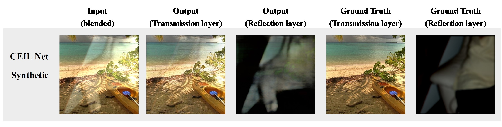
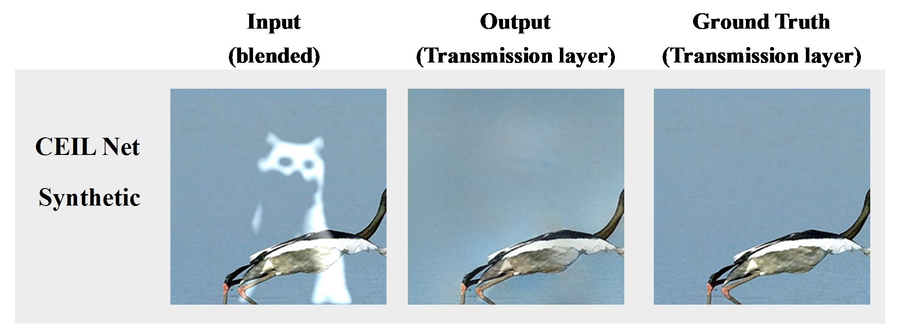
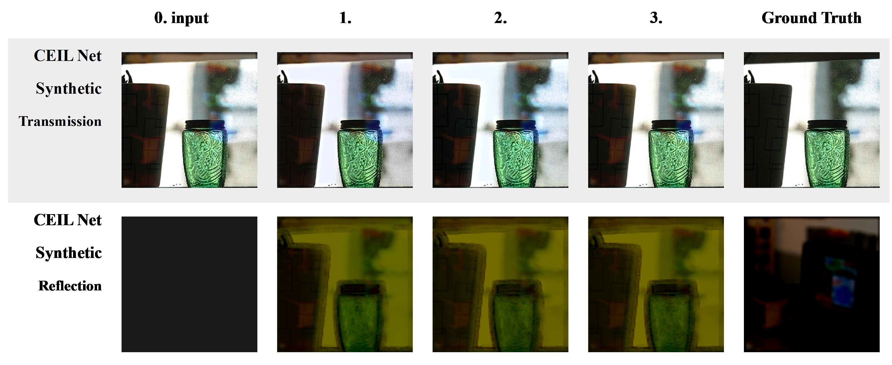

# Single Image Reflection Removal (SIRR)

This repository contains the implementation of my **final project** for the **Computer Vision (電腦視覺) course** at **National Chung Hsing University (NCHU)**. The project, titled **Single Image Reflection Removal (SIRR)**, evaluates and compares different SIRR methods by implementing three papers and testing their performance on several datasets.

Although this was a group project, I completed it individually.  
- **Team Member:** 7113056013, You Chen-Jui (游宸睿)

## Table of Contents
- [Introduction](#introduction)
- [Implemented Papers](#implemented-papers)
- [Datasets](#datasets)
- [My Setup](#my-setup)
- [Usage](#usage)
- [Results](#results)
- [Analysis](#analysis)
- [Conclusion](#conclusion)
- [References](#references)

## Introduction
In real-world photography, unwanted optical reflections are common, such as glass reflections or lens flares. **SIRR** aims to remove these reflections from a single image.

The goal of this project is to:
- Evaluate and compare the effectiveness of different SIRR models.
- Test these models on various datasets using metrics such as **PSNR**, **SSIM**, and **LPIPS**.

## Implemented Papers
1. **[Single Image Reflection Separation with Perceptual Losses (CVPR 2018)](https://openaccess.thecvf.com/content_cvpr_2018/papers/Zhang_Single_Image_Reflection_CVPR_2018_paper.pdf)**
2. **[Single Image Reflection Removal Exploiting Misaligned Training Data and Network Enhancements (CVPR 2019)](https://openaccess.thecvf.com/content_CVPR_2019/papers/Wei_Single_Image_Reflection_Removal_Exploiting_Misaligned_Training_Data_and_Network_CVPR_2019_paper.pdf)**
3. **[Single Image Reflection Removal through Cascaded Refinement (CVPR 2020)](https://openaccess.thecvf.com/content_CVPR_2020/papers/Li_Single_Image_Reflection_Removal_Through_Cascaded_Refinement_CVPR_2020_paper.pdf)**

## Datasets
### Training Datasets
- **[Pascal VOC](http://host.robots.ox.ac.uk/pascal/VOC/)** (7,643 images)
- **[Berkeley Real](https://github.com/ceciliavision/perceptual-reflection-removal)** (90 images)

### Testing Datasets
- **[CEILNet Synthetic](https://github.com/fqnchina/CEILNet/tree/master/testdata_reflection_synthetic_table2)** (100 images)
- **[Berkeley Real Testing](https://sir2data.github.io)** (20 images)
- **[SIR2 Dataset](https://sir2data.github.io)** (454 pairs across three subsets)
- **[Nature Dataset](https://github.com/ZhenboSong/RobustSIRR)** (20 images)

## My Setup
### Hardware
- **CPU**: AMD R5-3600
- **RAM**: 32GB DDR4
- **GPU**: GeForce RTX 3070 (8GB GDDR6)

### Software
- Python 3.x (specific versions vary per model)
- CUDA 11.8 and cuDNN 8.9.6
- Required Python libraries: TensorFlow, OpenCV, LPIPS, and others as listed in each paper's implementation.

### Installation
1. Clone the repository:
   ```bash
   git clone https://github.com/Rui0828/Single-Image-Reflection-Removal-2024-CV-Final-Project.git
   cd Single-Image-Reflection-Removal-2024-CV-Final-Project
   ```

## Usage
The code for each implemented paper is located in the `code` folder:
- `code/model_1_code` corresponds to [Perceptual Reflection Removal GitHub Repository](https://github.com/ceciliavision/perceptual-reflection-removal).
- `code/model_2_code` corresponds to [ERRNet GitHub Repository](https://github.com/Vandermode/ERRNet).
- `code/model_3_code` corresponds to [IBCLN GitHub Repository](https://github.com/JHL-HUST/IBCLN).

Each folder contains a custom `run.ipynb` file that documents the execution process, including training and testing. Modify dataset paths manually within the `run.ipynb` files before running.

### Training
To train the models, open the respective `run.ipynb` in your Jupyter Notebook environment and follow the instructions provided. All training logic, including dataset preparation and model execution, is contained within the notebook.

#### Training Parameters
Due to GPU hardware limitations, Out of Memory (OOM) errors occurred, preventing training for the desired number of epochs (100) with all datasets. Below are the training parameters used for each model:

- **Paper 1**: Cropped VOC dataset (100 samples), Berkeley Real dataset (109 samples), Epochs = 40
- **Paper 2**: Cropped VOC dataset (7,643 samples), Berkeley Real dataset (109 samples), Epochs = 5
- **Paper 3**: Cropped VOC dataset (7,643 samples), Berkeley Real dataset (109 samples), Epochs = 13

### Testing
Testing is integrated within the same `run.ipynb` files used for training. Open the appropriate notebook in the `code` folder and run the testing cells. Ensure that dataset paths are updated manually within the notebook before execution.

### Evaluating Metrics
The evaluation metrics for **PSNR**, **SSIM**, and **LPIPS** are integrated into the code for each model:

- **Paper 2 (Model 2)**: Built-in evaluation metrics automatically computed after testing.
- **Paper 1 (Model 1)** and **Paper 3 (Model 3)**: Evaluation scripts are located in `code/other_code/`.
  - For **Model 1**, use `eval_paper_1`.
  - For **Model 3**, use `eval_paper_3`.

Run these evaluation scripts to calculate and compare metrics.

## Results
Below is a comparison of the three models based on testing results from the `CEILNetSynthetic` dataset. For results on other datasets, refer to the `results` folder.

### Model 1 Results


### Model 2 Results

  > *Note: Model 2 only outputs the transmission layer, so comparisons for the reflection layer are not available.*

### Model 3 Results


## Analysis

### Comparison of Metrics
The table below presents the detailed performance metrics (PSNR, SSIM, and LPIPS) for the implemented SIRR methods across various datasets. Metrics are reported for **Paper [1]**, **Paper [2]**, and **Paper [3]**.

| **Dataset**           | **Index**       | **Paper [1]**       | **Paper [2]**       | **Paper [3]**       |
|------------------------|-----------------|---------------------|---------------------|---------------------|
| **CEILNet Synthetic** (100) | **PSNR↑**       | 29.32              | 20.66              | 28.71              |
|                        | **SSIM↑**       | 0.89               | 0.84               | 0.85               |
|                        | **LPIPS↓**      | 0.17               | 0.15               | 0.27               |
| **Berkeley Real** (20) | **PSNR↑**       | OOM                | OOM                | OOM                |
|                        | **SSIM↑**       | OOM                | OOM                | OOM                |
|                        | **LPIPS↓**      | OOM                | OOM                | OOM                |
| **SIR2 Objects** (200) | **PSNR↑**       | 29.86              | 20.30              | 29.84              |
|                        | **SSIM↑**       | 0.94               | 0.86               | 0.94               |
|                        | **LPIPS↓**      | 0.11               | 0.14               | 0.11               |
| **SIR2 Postcard** (199)| **PSNR↑**       | 28.35              | 17.90              | 29.44              |
|                        | **SSIM↑**       | 0.95               | 0.81               | 0.96               |
|                        | **LPIPS↓**      | 0.17               | 0.23               | 0.17               |
| **SIR2 Wild** (55)     | **PSNR↑**       | 30.18              | 22.03              | 30.19              |
|                        | **SSIM↑**       | 0.95               | 0.87               | 0.95               |
|                        | **LPIPS↓**      | 0.12               | 0.14               | 0.12               |
| **Nature** (20)        | **PSNR↑**       | 29.34              | 19.50              | 28.99              |
|                        | **SSIM↑**       | 0.87               | 0.72               | 0.86               |
|                        | **LPIPS↓**      | 0.18               | 0.25               | 0.17               |


### Note on Results
Each model had its limitations during my implementation (e.g., smaller training sets or insufficient epochs). Consequently, I do not consider the results highly reliable. Due to time constraints, I did not further test performance comparisons using similarly reduced datasets and epochs.

This project highlights the potential and challenges of SIRR methods. Based on my experiments:
- **Paper [1]**: Consistently achieves high **PSNR** and **SSIM**, with low **LPIPS** across most datasets.
- **Paper [3]**: Shows competitive performance, closely following **Paper [1]** on key metrics.
- **Paper [2]**: Underperforms due to limited training epochs and resource constraints. Metrics are comparatively lower, especially for **SIR2 Postcard** and **Nature** datasets.

## Conclusion
This project demonstrates the potential of different SIRR methods while highlighting the challenges of limited hardware resources. Further improvements can be achieved with better computational resources and extended training epochs.

## References
1. Zhang, X., Ren Ng, and Q. Chen. "Single image reflection separation with perceptual losses." CVPR, 2018.
2. Wei, K., et al. "Single image reflection removal exploiting misaligned training data and network enhancements." CVPR, 2019.
3. Li, C., et al. "Single image reflection removal through cascaded refinement." CVPR, 2020.
