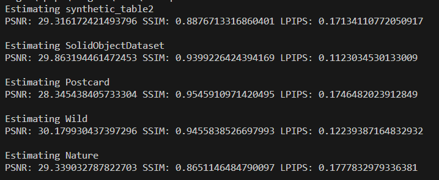

# Model 1 Code - ReadMe

## Implementation
**Paper Title**: Single Image Reflection Separation with Perceptual Losses (CVPR 2018)  
**Authors**: Zhang, Xuaner; Ren Ng; Qifeng Chen  
**Reference**:  
Zhang, Xuaner, Ren Ng, and Qifeng Chen. "Single image reflection separation with perceptual losses." In *Proceedings of the IEEE conference on computer vision and pattern recognition*, pp. 4786-4794. 2018.  

**Original Source Code**: [Perceptual Reflection Removal GitHub Repository](https://github.com/ceciliavision/perceptual-reflection-removal)

## Environment Specifications
- **CUDA Version**: 11.8  
- **cuDNN Version**: 8.9.6 (for CUDA 11.x)  
- **Python Version**: 3.10.9  
- **TensorFlow Version**: 2.10.1  

## Usage
1. Open `run.ipynb` in your Jupyter Notebook environment.  
2. Update the dataset and file paths as needed in the notebook.  
3. Follow the step-by-step instructions to execute the code.  

## Output
- **Testing Output**: The program generates result images as output.  
- **Evaluation Metrics**: The evaluation metrics (PSNR, SSIM, LPIPS) for the testing dataset are summarized in the screenshot below:

    

### Note
Ensure that all environment specifications match before running the notebook to avoid compatibility issues.
