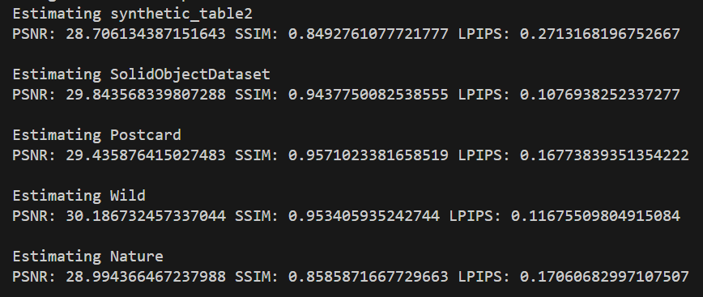

# Model 3 Code - ReadMe

## Implementation
**Paper Title**: Single Image Reflection Removal through Cascaded Refinement (CVPR 2020)  
**Authors**: Wei, Kaixuan; Jiaolong Yang; Ying Fu; David Wipf; Hua Huang  
**Reference**:  
Wei, Kaixuan, Jiaolong Yang, Ying Fu, David Wipf, and Hua Huang. "Single image reflection removal exploiting misaligned training data and network enhancements." In *Proceedings of the IEEE/CVF Conference on Computer Vision and Pattern Recognition*, pp. 8178-8187. 2019.  

**Original Source Code**: [IBCLN GitHub Repository](https://github.com/JHL-HUST/IBCLN)

## Environment Specifications
- **Python Version**: 3.11.2  

## Usage
1. Open `run.ipynb` in your Jupyter Notebook environment.  
2. Update the dataset and file paths as needed in the notebook.  
3. Follow the step-by-step instructions to execute the code.  

## Output
- **Testing Output**: The program generates result images as output.  
- **Evaluation Metrics**: The evaluation metrics (PSNR, SSIM, LPIPS) for the testing dataset are summarized in the screenshot below:

    

### Note
Ensure that your Python environment matches the specified version to avoid compatibility issues.
